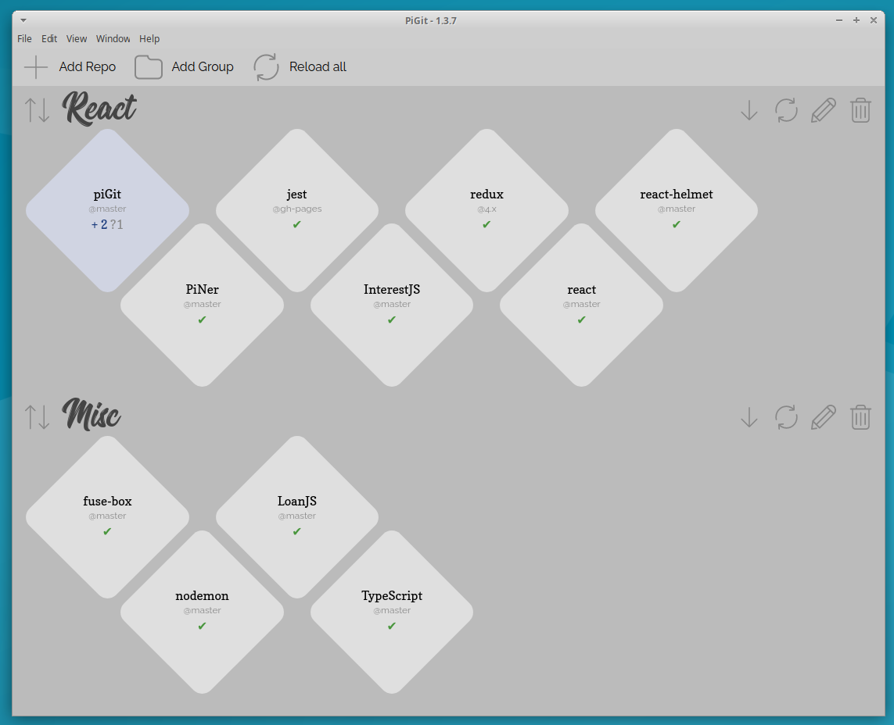
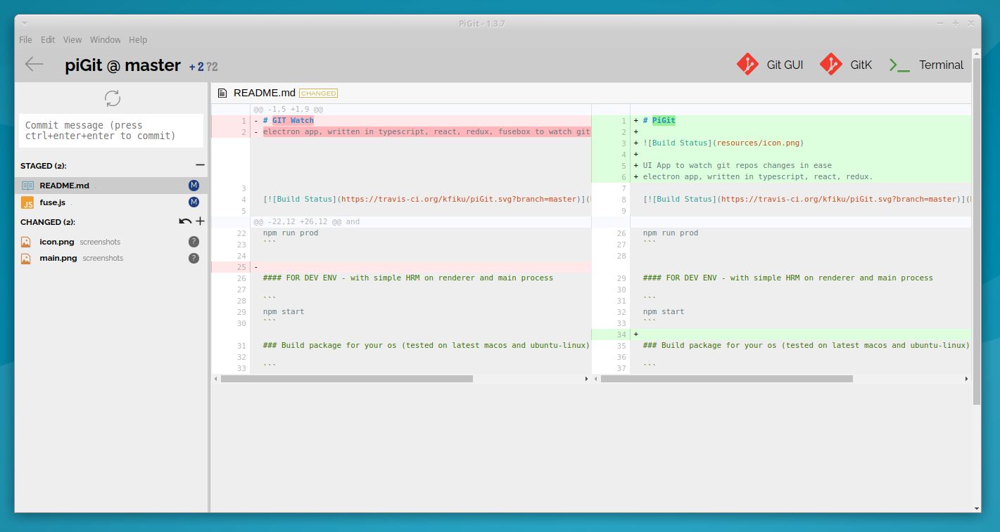

# PiGit

UI App to watch git repos changes in ease





electron app, written in typescript, react, redux.

[](https://travis-ci.org/kfiku/piGit)

### Debian / Ubuntu 64bit

Download latest version from [releases](https://github.com/kfiku/piGit/releases)

### From source
```
git clone https://github.com/kfiku/piGit.git
cd piGit
npm install
```
and
`npm start prod` or to build `npm run package`

#### FOR PRODUCTION ENV

```
npm run prod
```

#### FOR DEV ENV - with simple HRM on renderer and main process

```
npm start
```

### Build package for your os (tested on latest macos and ubuntu-linux)

```
npm run package
```

